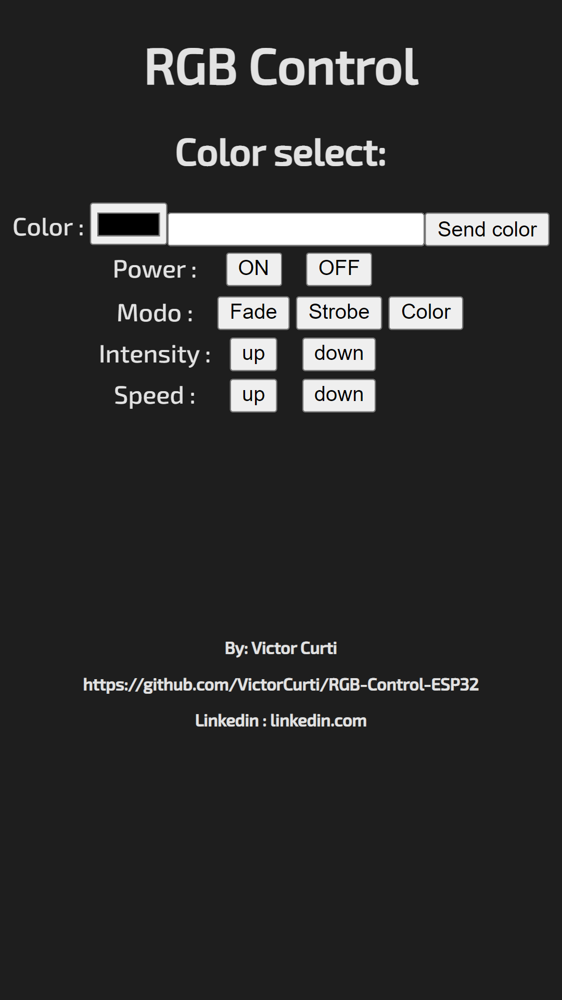
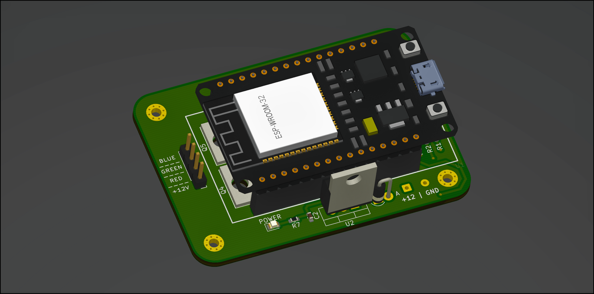
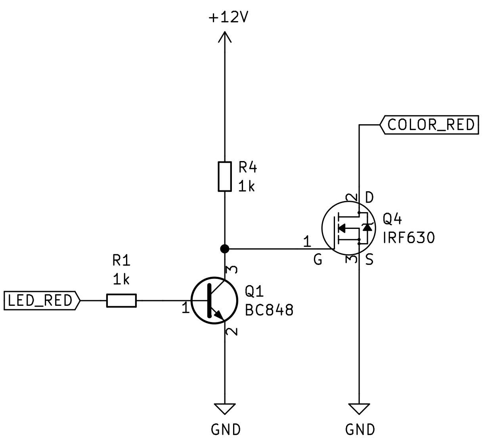
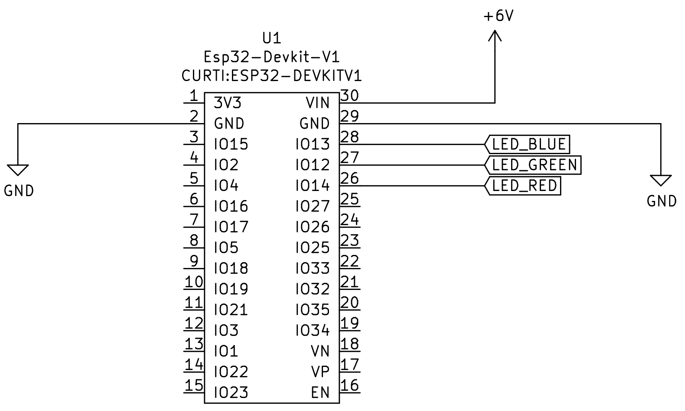
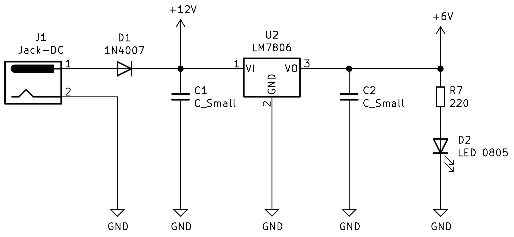
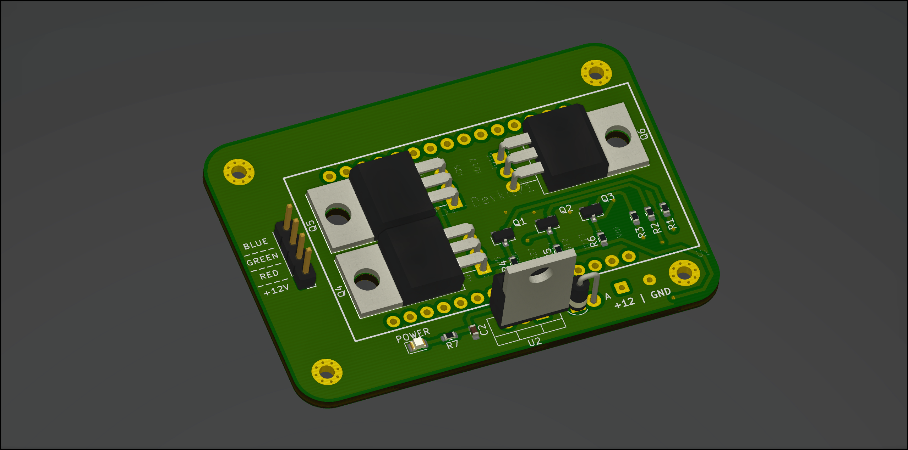
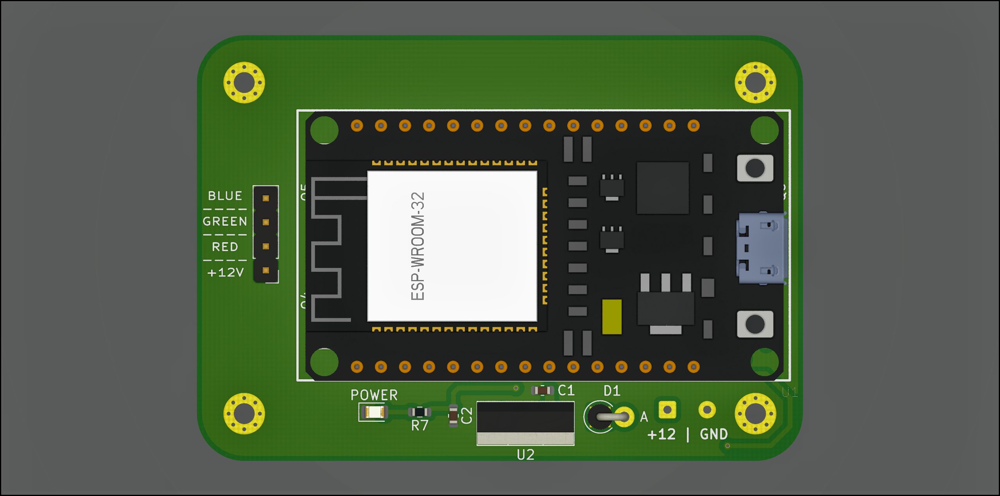
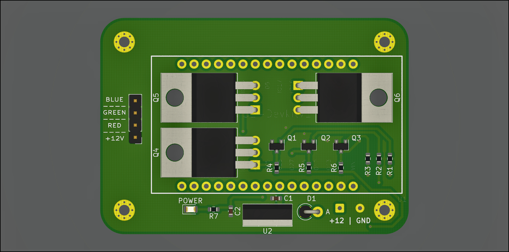

# RGB Control ESP32 by Victor Curti

# Application

## :page_with_curl: About :

This IOT project aims to control an RGB LED strip (SMD 5050) using Wifi network to communicate the aplication uising HTML5 or Alex voice comande, for this project the ESP32 DevKit V1 was chosen as a controller.

## :selfie: Interfaces :
<table>
  <tr>
    <td>HTML</td>
     <td>BLynk</td>
     
  </tr>
    <td></td>
 
 </table>
 
Was possible to acess webpage using any browser using as url:
```
  <IP_ADRRES.localhost:8080>

```

# Circuit 



## Schematic:

Full schematic: https://github.com/VictorCurti/RGB-Control-ESP32/blob/main/Kicad/RGB_Control.pdf

### Driver:



### Controller :



### Supply:



## PCB:


|   |  |
| ----------------------------------------------------- | ---------------------------------------------------- |
|   |  |
