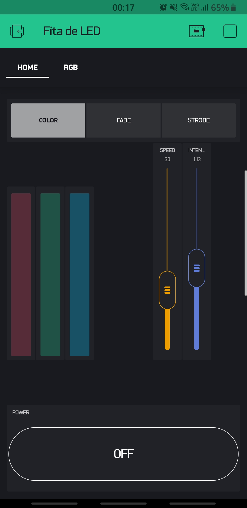
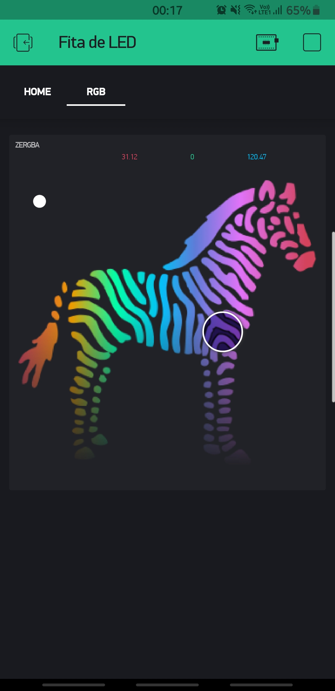
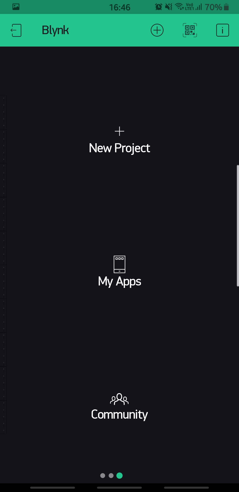

# RGB Control ESP32 by Victor Curti

# Application

## :page_with_curl: About :

This IOT project aims to control an RGB LED strip (SMD 5050) using Wifi network to communicate the APP Blynk or the HTML5 page as a microcontroller, for this project the ESP32 DevKit V1 was chosen as a controller.

## :selfie: Interfaces :
<table>
  <tr>
    <td>HTML</td>
     <td>BLynk</td>
     
  </tr>
  <tr>
    <td></td>
    <td></td>
  </tr>
 </table>
 
## :question: But what is Blynk: 

Blynk is a platform designed for the Internet of Things (IOT), with an application compatible with Android and iOS. It's a digital dashboard where you can build a graphical interface for your project in a simple and fast way, dragging and dropping widgets on the dashboard.

### :iphone: App dashboard: 

|  | |
| ----------- | ----------- |

Blynk official website [https://blynk.io/](https://blynk.io/)

## How to clone Blynk project :
1 - Download Blynk

|       |  |
| ----------- | ----------- |
| [Apple Store](https://apps.apple.com/us/app/blynk-iot-for-arduino-esp32/id808760481) | [Googple Play](https://play.google.com/store/apps/details?id=cc.blynk&hl=en_US) |

2 - With the application open, slide to the right and click on the QR code icon and scan the code below.

Obs.: For this project it is necessary to have a 2000 energy credit on Blynk. Initially when you create the account on the platform, your account starts with 2000 energies for free.

|   | 
| ----------- | ----------- |

# Circuit 

## Schematic:

Full schematic: https://github.com/VictorCurti/RGB-Control-ESP32/blob/main/Kicad/RGB_Control.pdf

### Driver:

### Controller :

### Supply:

## PCB:

|   |  |
| ----------------------------------------------------- | ---------------------------------------------------- |
|   |  |
